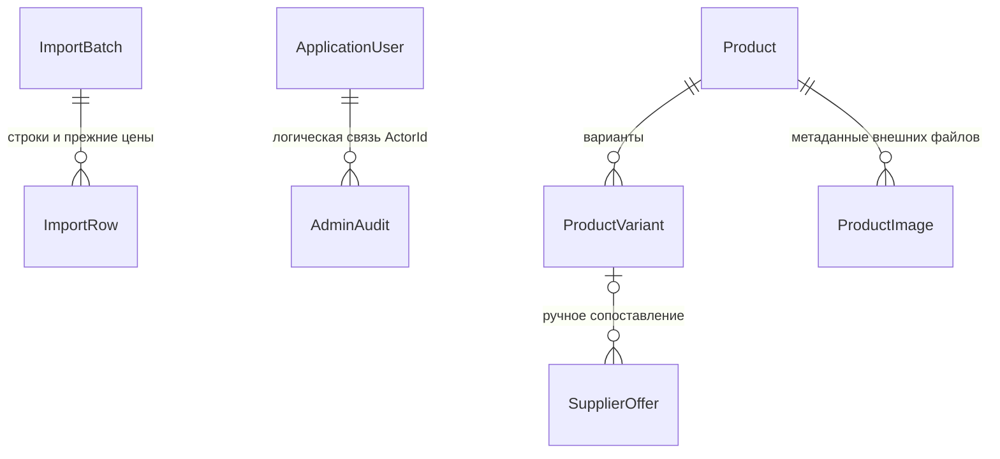
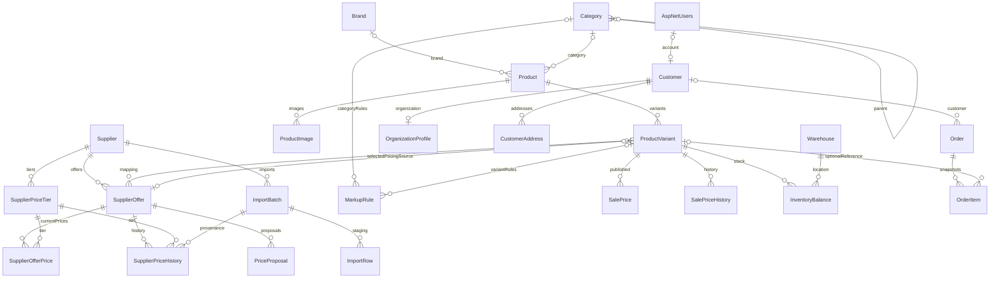
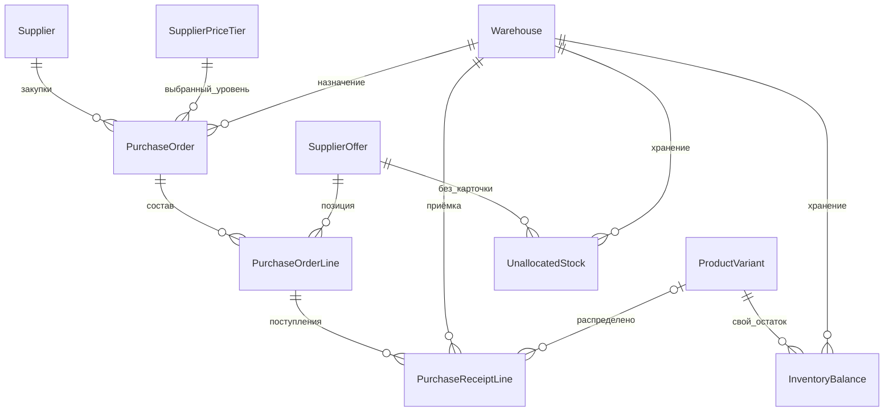
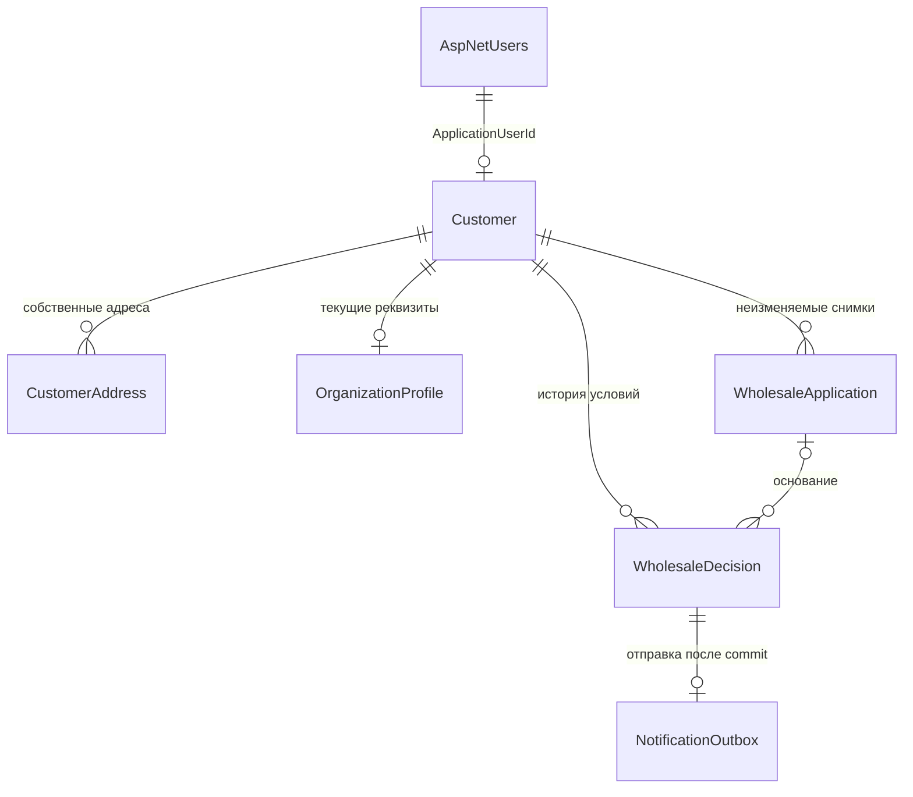
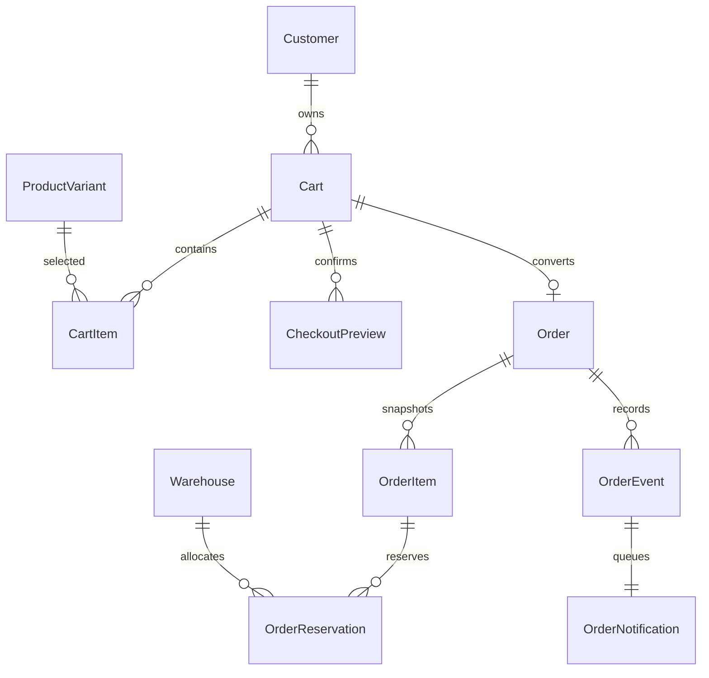

# База данных SportsStoreHMAO

## Дополнение административного этапа

Новая миграция `20260911125838_AdministrativeAuditAndImportSnapshots` добавляет `AdminAudit` и `ImportRow.BeforePricesJson`. Выполненные ранее миграции не переписаны. Поля и таблица имеют русские комментарии.

`AdminAudit` хранит сотрудника, UTC-время, действие, тип/идентификатор объекта, безопасное описание, причину и идентификатор операции. Уникальность `(ActorId, OperationId)` поддерживает повторы команд. Успешное бизнес-изменение и аудит фиксируются одной транзакцией. Журнал не содержит паролей, токенов, приглашений, полных реквизитов, адресов или XLS. Связь с Identity намеренно не каскадная: удаление аккаунта не удаляет историю действий.

`BeforePricesJson` — компактный снимок трёх прежних закупочных цен при проверке партии, чтобы браузерный отчёт сохранялся после удаления временного файла. Для прежних staging-строк значение `[]` означает отсутствие снятого ранее снимка, а не нулевую цену.



Команды используют ожидаемый `xmin` формы. Сопоставление выполняется под блокировкой поставщика; создание товара, варианта и связи атомарно. Смена источника и коммерческих настроек использует существующую модель ценообразования. Изображения хранятся вне БД, поэтому резервная копия должна включать БД и каталог `Storage:RootPath/images`.

## Границы
PostgreSQL + EF Core Code First. Все бизнес-таблицы и ASP.NET Core Identity находятся в одном ApplicationDbContext. Web при запуске **не** применяет миграции. Отдельный контекст создаётся через IDbContextFactory на операцию. Domain не ссылается на EF или Identity: ApplicationUserId — nullable string; FK к AspNetUsers определён в Infrastructure.

## Таблицы
| Область | Таблицы и назначение |
|---|---|
| Каталог | Product — собственная карточка Draft/Published/Archived; ProductVariant — уникальный SKU и единица продажи; Brand; Category с ParentId; ProductImage |
| Поставщики | Supplier — ревизия, выбранный подтверждённый тариф; SupplierPriceTier — закупочные условия; SupplierOffer — внешний код, сырой раздел, единица, nullable-остаток и сопоставление |
| Закупочные цены | SupplierOfferPrice — текущая цена по уровню; SupplierPriceHistory — старое/новое значение, партия, UTC |
| Импорт | ImportBatch — SHA-256, дата, версия, статус, ожидаемая ревизия и счётчики; ImportRow — номер, JSON исходных ячеек, нормализованная запись, диагностика |
| Клиенты | Customer — правовой тип, коммерческий сегмент и статус подтверждения; OrganizationProfile — ИНН/КПП; CustomerAddress |
| Продажные цены | MarkupRule — правило области и количественной ступени; PricingSettings — совместимость старых расчётов и явное автоприменение; общий минимум больше не используется; SalePrice — опубликованная цена, manual flag; SalePriceHistory; PriceProposal |
| Остатки | Warehouse; InventoryBalance — OnHand/Reserved и xmin |
| Основа заказов | Order — контактный/адресный/организационный снимок, валюта и формат продажи; OrderItem — SKU/название/единица/количество/фактическая цена/скидка |
| Идентификация | Стандартные AspNetUsers, AspNetRoles, claims, logins, tokens и joins. Роли Admin/Manager/Customer; seed паролей отсутствует |

У простой карточки также должен быть вариант. Первичный импорт вообще не создаёт Product или ProductVariant. Группировка похожих названий не выполняется. Дополнительная EAV-модель не добавлена: размер, цвет, артикул и штрихкод — типизированные поля варианта, остальные подсказки поставщика остаются на проверку.

## ER


## Ограничения и история
- Основные ключи Guid генерируются приложением. Identity сохраняет исходный string key.
- Уникальны SKU, код поставщика, (SupplierId, ExternalCode), предложение+тариф, партия+строка, SHA+поставщик+версия парсера, variant+segment+minQuantity, склад+вариант.
- Уникальные области MarkupRule используют PostgreSQL NULLS NOT DISTINCT: нельзя создать два общих правила с одинаковой ступенью.
- Строки имеют пределы длины, enum хранятся строками с check constraints.
- Закупочные суммы, коэффициенты и количества: numeric(18,4). Опубликованные суммы и история собственных цен: numeric(18,2). RUB; автоматической конвертации валют нет.
- Временные отметки UTC/timestamptz. Дата документа — DateOnly/date.
- Все бизнес-сущности имеют PostgreSQL xmin, настроенный IsRowVersion. Устаревшие изменения дают DbUpdateConcurrencyException; автоматическая перезапись не выполняется.
- Остаток: OnHand >= 0, Reserved >= 0, Reserved <= OnHand. Импорт не обращается к InventoryBalance.
- Большинство FK Restrict: случайное удаление не уничтожает историю. Ссылки OrderItem → Variant и Order → Customer допускают SetNull, сохраняя снимки. Изменение карточки или профиля не меняет снимки.
- Триггер Category проверяет рекурсивную цепочку родителей и сериализует изменения иерархии advisory lock. Самоссылка дополнительно запрещена CHECK.
- Триггер SupplierOfferPrice запрещает сочетание предложения и тарифа разных поставщиков.
- Формат ИНН: 10 или 12 цифр; КПП: NULL или 9 цифр. Проверка контрольной суммы/правового статуса относится к будущему сценарию ввода реквизитов.

## Цены
Явно выбираются Supplier.SelectedPriceTierId + PriceTierConfirmed и ProductVariant.PricingSupplierOfferId. Предложение предварительно сопоставляется с вариантом. Минимальная цена из нескольких поставщиков автоматически не выбирается.

SaleUnitsPerSupplierUnit означает **число единиц продажи магазина в одной ценовой единице поставщика**. Закупочная цена продажи = SupplierOfferPrice.Amount / коэффициент. Коэффициент должен быть положительным и явно подтверждённым. Количество в коробке, minimum order quantity и order multiple — отдельные сведения; коробка не подразумевает обязательной кратности. При смене единицы поставщика импорт снимает подтверждение перевода.

Цена = decimal.Round(cost / conversion × (1 + markup / 100), 2, AwayFromZero). 25% наценки на 100 = 125; это не 25% маржи.

Приоритет правил: вариант → ближайшая категория (затем вверх по ParentId) → общее. Сначала определяется область, затем наибольшая MinimumQuantity <= количеству. Нет перехода к менее приоритетной области из-за неподходящей ступени; настройте базовую ступень 1 в каждой используемой области. Для розницы ступень всегда 1. Оптовые ступени относятся к количеству одного SKU.

Propose создаёт предложения расчёта с отпечатком источников, правил и версий. Apply повторно проверяет отпечаток и ручную защиту в Serializable-транзакции. Ручную цену импорт не меняет. AutoApplyProposals отсутствует/false по умолчанию и включается отдельной командой. После изменения закупки предложения создаются для сопоставленных позиций с достаточной конфигурацией; заблокированные расчёты не публикуют цену. Команда propose сообщает отсутствие допустимых расчётов.

QuoteAsync получает ID аутентифицированного пользователя от доверенного серверного кода, читает клиента из БД. Для Wholesale необходимы Segment=Wholesale и WholesaleStatus=Approved. Pending/Rejected/гость получают розничный тип. Для подтверждённого оптовика без опубликованной ступени или без собственной настройки минимума заказа возвращается явная ошибка; скрытого перехода на розницу нет. Минимум оптового заказа возвращается в quote, а проверка общего итога заказа будет выполняться будущим checkout.

Налоговый режим не придуман: TaxTreatmentNote nullable, расчёт налогов отсутствует. Публикуемая сумма — заданная оператором сумма в RUB; перед продажами определить её налоговый смысл.

## Миграции
InitialCommerce — таблицы, FK, индексы, числовые ограничения и Identity; EnumAndCurrencyConstraints — enum/длины валюты; IntegrityGuards — триггеры и роли. ModelSnapshot хранится в Persistence/Migrations. docs/migrations.sql получен штатным EF CLI для обзора, не заменяет Code First.
```powershell
dotnet ef migrations add YourChange --project src/SportsStore.Infrastructure --startup-project src/SportsStore.Infrastructure --output-dir Persistence/Migrations
dotnet ef database update --project src/SportsStore.Infrastructure --startup-project src/SportsStore.Infrastructure
dotnet ef migrations has-pending-model-changes --project src/SportsStore.Infrastructure --startup-project src/SportsStore.Infrastructure
```

## Русские комментарии в PostgreSQL

Миграция `20260910221549_RussianDatabaseComments` добавляет описания всех 32 таблиц и 218 пользовательских колонок, включая Identity и `__EFMigrationsHistory`. Проверено на локальной БД: пропущенных комментариев нет, количество предложений и закупочных цен не изменилось. Повторное применение миграций не вносит изменений.

Описания модели находятся в `src/SportsStore.Infrastructure/Persistence/RussianDatabaseComments.cs` и сохраняются в model snapshot. Комментарии служебной истории миграций заданы непосредственно в миграции, поскольку эта таблица не входит в модель DbContext. Скрытые системные колонки PostgreSQL не входят в указанные 218 колонок; назначение используемого `xmin` описано в EF-модели и разделе о конкуренции.

В DBeaver обновите схему клавишей F5 и заново откройте таблицу. Описание таблицы находится в её свойствах, описание поля — в столбце «Комментарий» (Comment/Description) списка колонок. При изменении схемы добавляйте описание новой таблицы или свойства в карту комментариев и создавайте новую EF-миграцию.

## Источники и совместимость
- [Npgsql EF Core 10](https://www.npgsql.org/efcore/release-notes/10.0.html).
- [EF Core Design 10.0.11](https://www.nuget.org/packages/Microsoft.EntityFrameworkCore.Design/10.0.11): EF/Identity/dotnet-ef закреплены на 10.0.11, Npgsql provider 10.0.3 совместим с EF Core 10.0.4+ в ветке 10.
- [Официальный PostgreSQL Docker image](https://hub.docker.com/_/postgres): выбран 17.11-bookworm, том /var/lib/postgresql/data. Для 18+ путь отличается; major upgrade требует отдельного плана миграции данных.


## Закупочные заказы и приёмка

Миграция `20260911174207_SupplierPurchasingAndReceiving` расширяет модель без удаления прежних таблиц или данных. Все новые таблицы и пользовательские поля имеют русские комментарии; `xmin` описан отдельно как системная версия PostgreSQL.

| Объект | Назначение |
|---|---|
| PurchaseOrder | Закупка поставщику: статус, склад, номер, сотрудник, снимок выбранного уровня и порога |
| PurchaseOrderLine | Снимок кода, названия, единицы, коробки и трёх цен; выбранная цена, заказанное и принятое количество |
| PurchaseReceiptLine | Факт отдельной приёмки строки: количество, UTC-время, склад, идентификатор операции, вариант и коэффициент при распределении |
| UnallocatedStock | Собственный физический товар без распределения в вариант; уникальная пара предложение/склад |
| SupplierPriceTier.ManualMinimumAmount | Ручной порог поверх исходного; null использует исходный MinimumAmount |



`PurchaseOrder` не связан с покупательскими `Order`/`OrderItem`. `CreatedBy` хранит строковый идентификатор сотрудника как исторический след без каскадного удаления при удалении Identity-пользователя. Номер уникален; один Draft на сотрудника и поставщика защищён частичным уникальным индексом. Строка уникальна по заказу/предложению. Приёмка уникальна по идентификатору операции/строке. Внешние ключи новых объектов — Restrict.

CHECK ограничивает количество строки 1…1 000 000, принятое 0…заказанное, положительные известные цены, неотрицательные пороги и нераспределённый остаток. Исторические decimal — numeric(18,4), ручной рублёвый порог — numeric(18,2); опубликованные цены округляются до копеек. Связь выбранного тарифа с поставщиком дополнительно проверяет серверная команда. `xmin` обеспечивает optimistic concurrency; advisory locks сериализуют команду до чтения. Склад, строки, статус и аудит фиксируются атомарно.

При создании карточки ранее принятые нераспределённые количества переводятся в InventoryBalance и обнуляются в UnallocatedStock в одной транзакции. Исторические приёмки получают назначение варианта и коэффициент; изменение сопоставления после этого блокируется. `Reserved` не меняется. Доступность «в пути» вычисляется из неполученных количеств подтверждённых закупок; не является физическим остатком.

Применение новой миграции, резервное копирование и восстановление выполняются теми же командами EF/pg_dump/pg_restore, что описаны выше. Откат Down удаляет закупочную историю и не предназначен для обычного обновления.

Дополнительная миграция `20260911180503_PreserveReceivedSupplierUnit` хранит единицу UnallocatedStock независимо от текущего прайса. Если единицы различаются, распределение и смешивание остатков запрещены; для старой несверенной записи пустая единица также блокирует перенос. Миграция не угадывает перевод по новой строке поставщика.


## Публичное чтение, этап 3

Схема не изменена. StorefrontService читает Published и положительные базовые Retail/RUB-цены, фильтрует один вариант в SQL и использует RepeatableRead для согласования страницы и счётчиков. Закупочные суммы в DTO не попадают. Дерево категорий строится рекурсивным CTE. Правила и измерения: [storefront.md](storefront.md).


## Четвёртый этап: аккаунты и заявки

Миграция `CustomerAccountsWholesale` добавляет три таблицы, не меняя существующие Customer и AspNetUsers. Все новые таблицы и колонки имеют русские комментарии. Сохраняются строковый ключ Identity и уникальная nullable-связь Customer.ApplicationUserId.

- **WholesaleApplication** — снимок реквизитов, состояние, время подачи/решения UTC, версия xmin и OperationId. Частичный уникальный индекс запрещает две Pending-заявки одного Customer.
- **WholesaleDecision** — неизменяемое событие одобрения, отказа или отзыва; nullable ApplicationId означает прямое решение без заявки. OperationId уникален.
- **NotificationOutbox** — одно уведомление на решение, число попыток, время следующей попытки, аренда, SentAt и безопасный код ошибки. Открытые Identity-токены и реквизиты здесь не хранятся.



FK истории используют Restrict; каскадное уничтожение решений вместе с покупателем запрещено. `Customer` блокируется до работы с заявкой, проверяются xmin и снимок. Команда решения сохраняет Customer, заявку, историю, аудит и outbox в одной транзакции. Старые Approved-покупатели сохраняются без синтетических заявок.

Локальное резервное копирование прежним `pg_dump` включает новые таблицы. Вместе с базой отдельно защищайте постоянные ключи Data Protection: они нужны для действующих cookie и ссылок Identity. Файлы Capture с временными токенами не являются необходимой частью резервной копии бизнес-данных.

## Этап 5: покупательские заказы

Добавлены Cart (владелец: Customer либо hash гостя), CartItem (уникальный вариант корзины), CartOperation (ключ добавления), CheckoutPreview (условия и TTL), OrderReservation (распределение по складам), OrderEvent (идемпотентная история), OrderNotification (аренда и повторы). Order/OrderItem расширены снимками и состоянием, существующие таблицы не заменены. Все новые сущности используют xmin; числовые количества и цены decimal. Русские комментарии таблиц/полей включены в миграцию.



FK Restrict сохраняют историю. Уникальны CheckoutOperationId, CartId заказа, OperationId события и EventId уведомления. Старые заказы Historical не получают фиктивные резервы; итог восстанавливается из прежних строк. Подробности в reservations.md и customer-orders.md.
